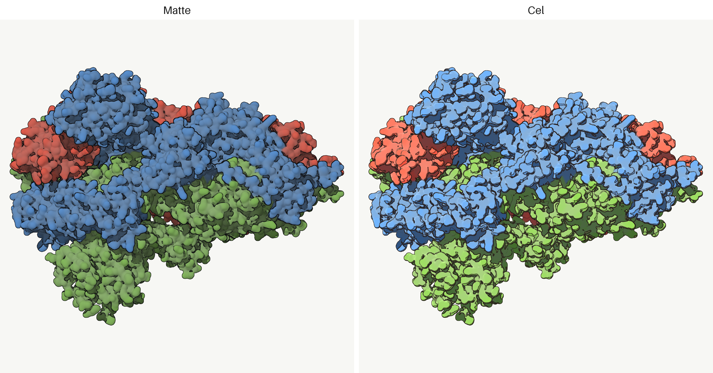
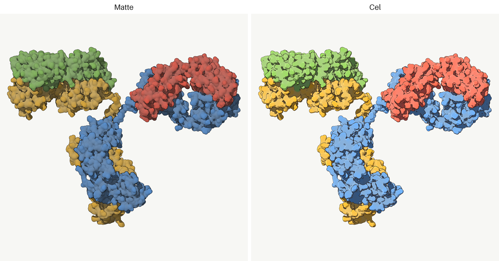
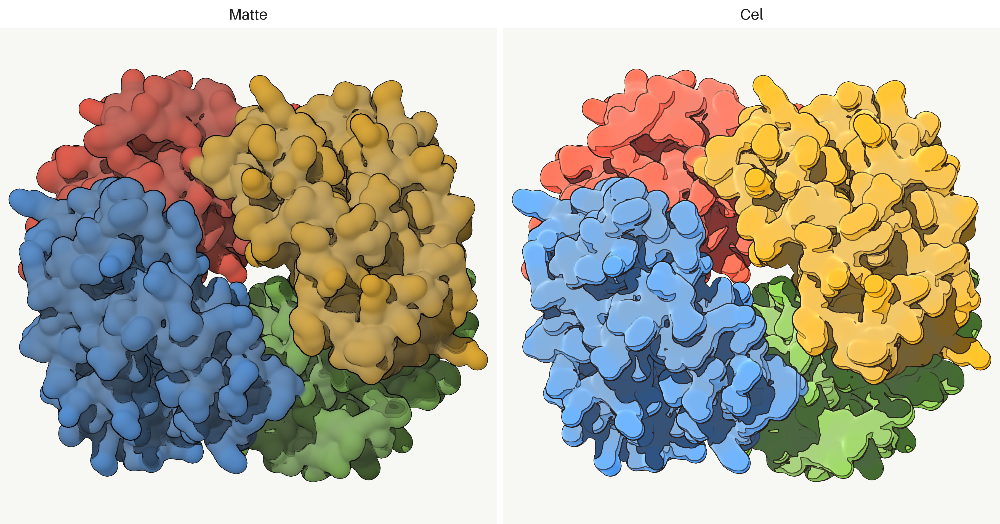
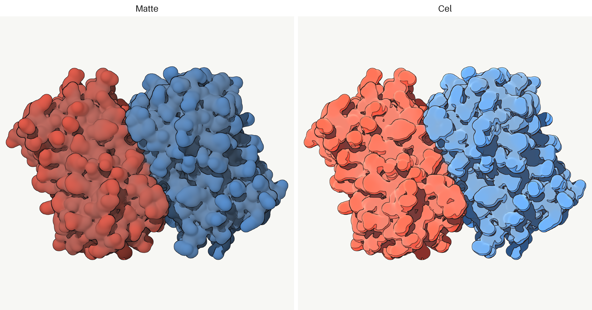

# siroccomol

Render proteins as space-filling molecular surfaces in two styles.

- `matte`: flat diffuse shading with soft cast shadows and dark silhouette and crevice contours (Goodsell-inspired).
- `cel`: saturated, posterized anime cel shading with crisp flat cast shadows, cool shadow tones, a warm highlight and a rim light (similar to a well known illustration style optional sky-gradient backdrop via `sky`).

A protein's atoms sit at bond distances, so the renderer builds a smooth isosurface over them, ray-marches it on the GPU, shades it, and inks the contours. It runs headless through EGL.

The name is a nod to the sirocco, the hot Mediterranean wind.

## Gallery

**GroEL/GroES chaperonin · [1AON](https://www.rcsb.org/structure/1AON)**, [video](gallery/1AON_spin.mp4)

<table><tr>
<td><a href="gallery/1AON_spin.mp4"></a></td>
</tr></table>

**20S proteasome · [1PMA](https://www.rcsb.org/structure/1PMA)**, [video](gallery/1PMA_spin.mp4)

<table><tr>
<td><a href="gallery/1PMA_spin.mp4"></a></td>
</tr></table>

**SARS-CoV-2 spike · [6VXX](https://www.rcsb.org/structure/6VXX)**, [video](gallery/6VXX_spin.mp4)

<table><tr>
<td><a href="gallery/6VXX_spin.mp4"></a></td>
</tr></table>

**Immunoglobulin · [1IGT](https://www.rcsb.org/structure/1IGT)**, [video](gallery/1IGT_spin.mp4)

<table><tr>
<td><a href="gallery/1IGT_spin.mp4"></a></td>
</tr></table>

**Haemoglobin · [4HHB](https://www.rcsb.org/structure/4HHB)**, [video](gallery/4HHB_spin.mp4)

<table><tr>
<td><a href="gallery/4HHB_spin.mp4"></a></td>
</tr></table>

**Green fluorescent protein · [1GFL](https://www.rcsb.org/structure/1GFL)**, [video](gallery/1GFL_spin.mp4)

<table><tr>
<td><a href="gallery/1GFL_spin.mp4"></a></td>
</tr></table>

## Install

```bash
uv pip install siroccomol
```

Needs a GPU with a headless GL/EGL driver (NVIDIA with `libEGL`, or Mesa), and `ffmpeg` for the spin videos.

## Use

A PDB id is fetched from RCSB automatically.

```bash
siroccomol 4HHB --style cel -o hemoglobin.png
siroccomol 4HHB --compare -o compare.png
siroccomol 4HHB --spin --compare -o compare.mp4
siroccomol 4HHB --spin -o spin.mp4 --frames 120 --px 1080 --ss 3   # high-quality video
siroccomol my_structure.pdb --color-by element --px 1600
```

```python
import siroccomol

siroccomol.render_protein("4HHB", style="cel", out="hemoglobin.png")
siroccomol.compare("4HHB", out="compare.png")
siroccomol.compare_spin("4HHB", out="compare.mp4")
siroccomol.spin("4HHB", out="spin.mp4", frames=120, px=1080, ss=3)
img = siroccomol.render_protein("1UBQ", style="matte")
```

## Options

| option | meaning |
|---|---|
| `style` | `cel` or `matte` |
| `color_by` | `chain` (one colour per subunit) or `element` (CPK) |
| `iso` | isosurface level. higher gives tighter, smaller spheres; lower inflates the atoms |
| `sfrac` | kernel width as a fraction of atom spacing. bigger is smoother (only with `--no-vdw`) |
| `vdw` | atom radii match Bondi van der Waals values (default; exact at `iso=0.1`). `--no-vdw` / `vdw=False` gives the uniform `sfrac` kernel |
| `sky` | illustration-style sky-gradient backdrop for `cel` (off by default) |
| `grid` | voxel resolution of the density field. default auto-scales with assembly size (~0.5 Å/voxel, clamped to 192–336) |
| `px` | output size |
| `frames`, `fps` | frames per turn and video frame rate, for `spin` and `compare_spin` |
| `ss` | supersampling factor for `spin` and `compare_spin` |

`spin` and `compare_spin` encode a high-quality H.264 video (`.mp4`/`.mov`/`.mkv`), which needs
`ffmpeg` on PATH. Good quality settings are `frames=120`, `fps=30`, `px=1080`, `ss=3`, `crf=17`
(Python only).

## How it works

1. Voxelize the atoms into a density field plus a smooth per-voxel colour, in a grid aligned to the structure's principal axes. Exposed atoms get a saturation boost first, so terminal side-chain bumps pop (Goodsell-style).
2. Ray-march the `density = iso` isosurface on the GPU.
3. Shade from the surface normal (the density gradient), and cast a shadow ray through the volume toward the light. Matte is diffuse with a soft shadow; cel is a saturated 4-tone with a crisp flat shadow and rim light.
4. A contour pass inks the silhouette, the occluding depth edges and the colour boundaries, with the line width scaled to the structure's feature size.

For animation the volume is built once and the camera orbits per frame.

## Thanks
The shader I used is based on [ghibli-style-shader](https://github.com/craftzdog/ghibli-style-shader) by the brilliant [craftzdog](https://www.craftz.dog/).

MIT licensed. The official illustrations in `gallery/goodsell/` are by David S. Goodsell and the RCSB PDB, from PDB-101 Molecule of the Month, used under [CC-BY-4.0](https://creativecommons.org/licenses/by/4.0/).
